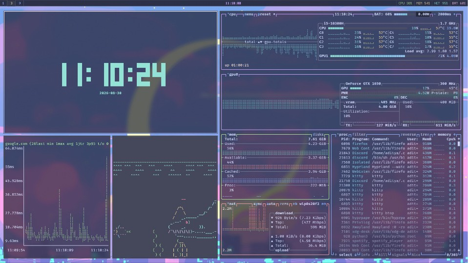
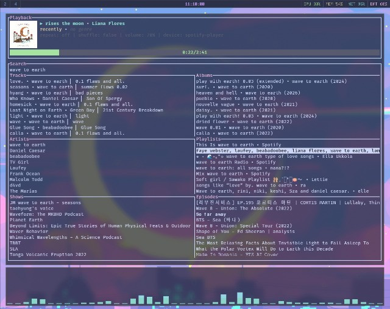

# dotfiles

My personal Linux setup — configuration for the programs I use day to day.

## Overview

| Area | Programs |
| --- | --- |
| Compositor / session | Hyprland (`hypr/`), hyprlock, hyprpaper |
| Bar | Waybar (`waybar/`) — default and a `retro` theme |
| Launcher | wofi (`wofi/`), rofi (`rofi/`) |
| Terminals | kitty (`kitty/`), Alacritty (`alacritty/`) |
| Notifications | dunst (`dunst/`) |
| Shell | zsh (`zshrc`) with powerlevel10k |
| Editors | Neovim (`nvim/`), Doom Emacs (`doom/`) |
| Browser | qutebrowser (`qutebrowser/`) |
| Chat | WeeChat (`weechat/`) |
| Music | spotifyd (`spotifyd/`) + spotify-player / spotify-tui (`spotify-tui/`) |
| Monitors | btop (`btop/`), htop (`htop/`), conky (`conky/`), cava (`cava/`) |
| Docs | zathura (`zathura/`) |
| Misc | lazygit (`lazygit/`), `wifi.zsh` helper |

Most things follow the **Catppuccin Macchiato** palette.

## Layout

Each top-level folder mirrors `~/.config/<folder>`; `zshrc` maps to `~/.zshrc`
and `wifi.zsh` to `~/wifi.zsh`. Copy or symlink whichever pieces you want.

## Notes

- Secrets are **not** stored here. `weechat/irc.conf` keeps `libera.sasl_password`
  empty, and the `iit` / `iitjump` aliases in `zshrc` read passwords from the
  `IIT_SSH_PASS` / `IITJUMP_SSH_PASS` environment variables.
